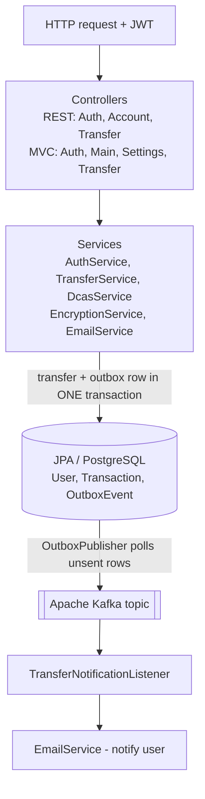

# DCAS — Secure Banking System

A Spring Boot banking backend built around a custom **Dynamic Challenge Authentication System (DCAS)**: high‑value money transfers are authorized with a layered challenge that combines **TOTP** (time‑based one‑time passwords) and a **secret‑word** check, on top of standard JWT authentication. The system uses an **event‑driven, Transactional‑Outbox** pipeline over Apache Kafka for reliable, at‑least‑once transfer notifications.

<p>
  
  
  
  
  
  
  
  
</p>

---

## Why this project

Most demo banking apps stop at "login + transfer". DCAS focuses on the two parts that actually matter in a real financial system:

1. **Authorization strength for risky operations** — a normal login is not enough to move large amounts. High‑value transfers trigger a second, dynamic challenge (TOTP + secret word).
2. **Reliable side effects** — a transfer must never "succeed but lose its notification". The Transactional Outbox pattern guarantees the notification event is committed in the same database transaction as the transfer, then published to Kafka.

---

## Key features

- **JWT authentication** — stateless auth with a custom `JwtAuthFilter` and `JwtService`.
- **DCAS challenge flow** — `DcasService` enforces TOTP (`googleauth`) + secret‑word verification before authorizing high‑value transfers.
- **Account & transfer domain** — balance queries, transfer validation, insufficient‑balance and account‑lockout handling.
- **Security hardening** — BCrypt password hashing, AES‑encrypted secrets (`EncryptionService`), account lockout, server‑side validation.
- **Event‑driven notifications** — `OutboxEvent` + `OutboxPublisher` + `TransferNotificationListener` over Kafka, using the **Transactional Outbox** pattern (at‑least‑once delivery).
- **Email notifications** — `EmailService` (Spring Mail) for transfer events.
- **Dual interface** — REST API (`/api/...`) for programmatic use **and** server‑rendered Thymeleaf pages for the web UI.
- **Robust error handling** — domain exceptions + a `GlobalExceptionHandler` returning structured `ErrorResponse` payloads.

---

## Architecture



**Transactional Outbox in short:** the transfer and its `OutboxEvent` are written in one DB transaction. A separate publisher reads unsent outbox rows and pushes them to Kafka, so the notification can never be lost even if the broker is momentarily down.

---

## Tech stack

| Layer | Technology |
|---|---|
| Language / runtime | Java 21 |
| Framework | Spring Boot 3 (Web, Security, Data JPA, Validation, Mail) |
| Auth | JWT (`jjwt`), BCrypt, TOTP (`googleauth`) |
| Messaging | Apache Kafka (`spring-kafka`) |
| Persistence | PostgreSQL + Spring Data JPA |
| View | Thymeleaf + Spring Security integration |
| Build | Maven (`mvnw` wrapper) |
| Infra | Docker / Docker Compose |

---

## Getting started

### Prerequisites
- JDK 21
- Docker & Docker Compose (for PostgreSQL + Kafka)

### Run

```bash
# 1. Start PostgreSQL and Kafka
docker-compose up -d

# 2. Configure src/main/resources/application.properties
#    (DB url/credentials, mail SMTP, JWT secret) — see below

# 3. Build & run
./mvnw spring-boot:run        # Windows: mvnw.cmd spring-boot:run
```

The app starts on `http://localhost:8080`.

### Configuration

Set these in `application.properties` (or as environment variables):

| Key | Description |
|---|---|
| `spring.datasource.url` / `username` / `password` | PostgreSQL connection |
| `spring.kafka.bootstrap-servers` | Kafka broker address |
| `spring.mail.*` | SMTP settings for notification emails |
| `app.jwt.secret` | Signing key for JWT |
| `app.encryption.key` | AES key for encrypting secrets |

> Do not commit real secrets. Use environment variables or a local, git‑ignored properties file.

---

## Project structure

```
src/main/java/org/otp/dcas_banking_system/
├── config/        # SecurityConfig, KafkaConfig
├── controller/    # MVC controllers + controller/api (REST)
├── dto/           # Request/response + event DTOs
├── exception/     # Domain exceptions + GlobalExceptionHandler
├── messaging/     # OutboxPublisher, TransferNotificationListener
├── model/         # User, Transaction, OutboxEvent, statuses
├── repository/    # Spring Data JPA repositories
├── security/      # JwtService, JwtAuthFilter
└── service/       # Auth, Transfer, Dcas, Encryption, Email, ...
```

---

## Security notes

- Passwords are stored as BCrypt hashes; sensitive secrets are AES‑encrypted at rest.
- High‑value transfers require a successful DCAS challenge (TOTP + secret word) in addition to a valid JWT.
- Repeated failed attempts trigger account lockout.
- All state‑changing endpoints validate ownership and input server‑side.

---

## License

This project was built for educational purposes. See repository settings for license details.
